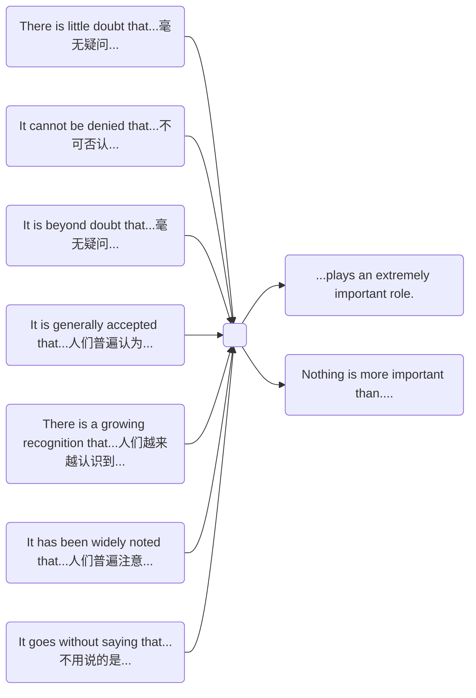
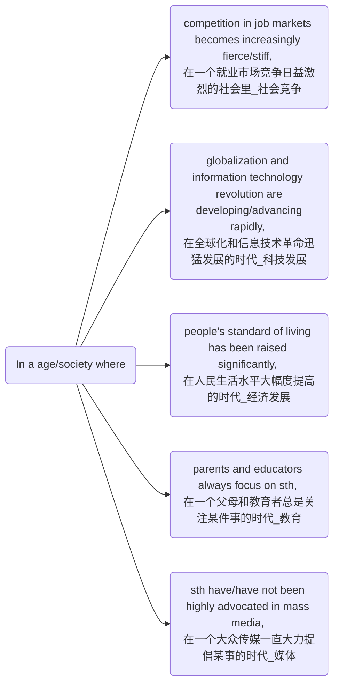
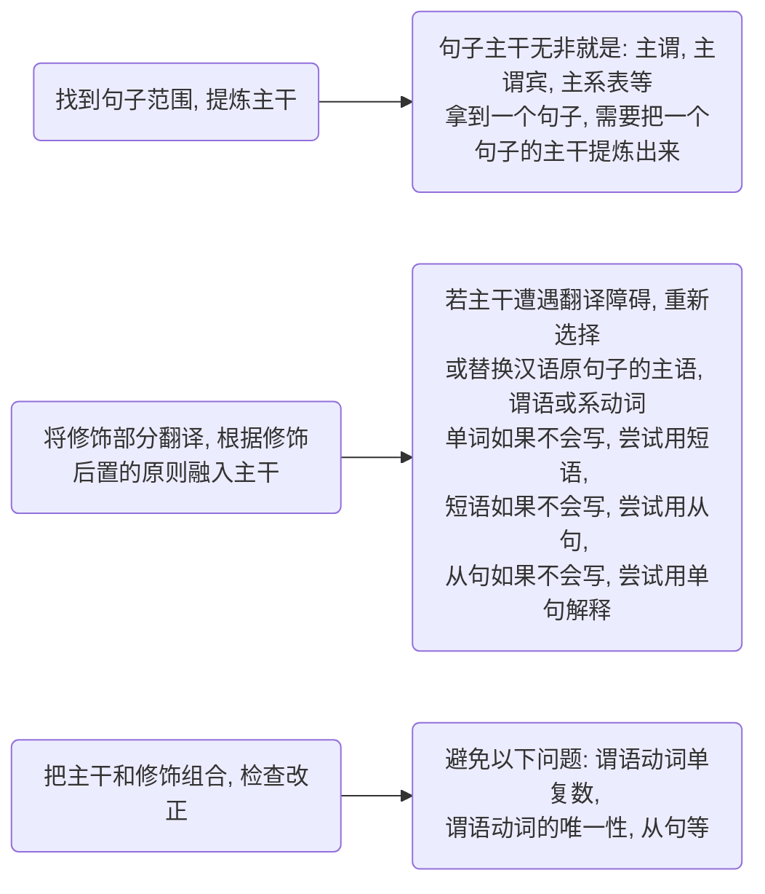

**15:10——17:25** ，实际作答时间110分钟

*14:40——15:00* 试音时间

*15:00——15:10* 阅读考场注意事项，发放考卷，贴条形码

*15:10——15:40* 作文考试阶段

*15:40——16:10* 听力测试

*16:10——16:15* 考试暂停5分钟，收答题卡1（即作文和听力）听力结束后完成剩余考项（阅读和翻译）

*17:25* 全部考试结束

## 写作（30分钟，106.5分）

[六级写作模板170+保姆教程！基础一般也能拿！](https://zhuanlan.zhihu.com/p/357293671)

**审题，构思（2-3分钟）**

**写正文（25分钟）**

注意卷面，少涂改，写错了杠掉就好了，不要涂！分三段，少一些模板的，假大空的东西。

#### 意义措施类

**首段**：话题引入 & 主题阐述

*第一句：*

**In a rapidly developing society,** **it is generally accepted that** **...** **plays a fundamental role in** **....**

*第二句：*

**主题词+,which(非限制性定语从句)+模板句**

**中间段**：背景句 & 第一方面(背景句+论据+例子）& 第二方面(not only,but also+举例)

*第一句：*

**There are two fundamental factors contributing to this phenomenon.**

造成这种现象有两个基本因素
**As regards to the social implication of ..., my discussion on the issue is mainly twofold**

关于...的社会影响, 我的讨论主要有两个方面

*第一方面：*

-**背景句**

-**论据**

**an increasing number of people find it helpful/difficult/harmful to /sth/do sth...**

-**论点**——中间段第一方面的总结

**Thus ... is not a choice, but a must to meet the ever-growing demands of our society.**

因此，...不是一种选择，而是满足社会日益增长的需求的必然选择。**（语气较强烈）**

**Thus ... is a wise choice to meet the ever-growing demands of our society.**

因此，...是满足社会日益增长的需求的明智选择。**（语气缓和）**

*第二方面*

**-not only, but also...**（题目明确要求举例，所以最好举例，水平实在举不来例子的，用**备选方案if**也可以)

**...not only..., but also...** 一小一大，两个方面

-**举例**

举**具体的人或事**，比如姚明，屠呦呦，华为，苹果等这些具体的事物，然后套用举例模板

**For instance, sb/sth,（后置定语), do sth,（非限制定语从句)**

**尾段**：总结 & 2个建议措施

**题目中并没有明确要求我们写措施，所以我们写“一个措施”即可，如果字数不够，可以写两个措施**

总结：

**To sum up, it is of great benefit for us to ... and ....**

举措：

举措1：**Specifically, the fundamental way is that ....**

举措2：**Meanwhile, ....**

**观点选择类**

**现象解释类**

**谚语警句类**

**图画类**

**最后1分钟,检查一遍**

[英语作文如何不出错](https://zhuanlan.zhihu.com/p/361770360)

减少低级语法错误

## 听力（30分钟，248.5，占整套试题的35%，每个题都是7.1分）

[听力攻略](https://zhuanlan.zhihu.com/p/380675880)

$(4+4)*7.1+(3+4)*7.1+(3+3+4)*14.2$

##### 技巧1 不要听题目，不要听题目，不要听题目！

**题目中的四个选项都读到**：

​	*第一，重点关注最后一个读到的内容和重复读到的内容*

​	*第二，如果还不确定，去听一下这道题的题目，但仅限于这道题*

**文章一结束，你的答案就选出来，**

没听到就拉倒,千万不要花时间冥思苦想。果断放弃纠结，开始预览下一题的选项。每道题开始前，都要利用空隙去预读选项。

##### 技巧2 预读选项

**把听题目的时间，放在预读选项中**

拿到一个选项：如果有时间通读的话，就通读一下选项，没有时间就拉倒！直接进行标记，标记的内容有：

**选项核心：否定词、动宾（动词名词）、系表（动词形容词）**

**动宾和系表翻译成人话：就是选项中的动词+名词/形容词**

**动词划一句话中最核心的动词**

**注：**

**1.如果有不认识的生词，不要标记生词**

**2.选项如果不好翻，就不要费力翻译**

**3.不要盯着一个选项一直看**

**4.在听文章时，如果发现选项中某个单词被读到了，那就说明目前在这道题的范围中**

##### **技巧3 视听一致（所听即所得）（四六级听力正确答案原则一）**

首先关于视听一致的题目，一般选项长度都会非常长，信息非常多，所以预读选项就非常关键。

其次，稍微有点难度的视听一致题目仅会在关键信息给到你提示，其他部分并不会提到，以此来加大难度。

最后，目前六级最最最常见的就是这样，视听一致+同义替换放在一起

在遇到**视听一致**的题目时，在听到原文中有选项完全一样的单词先不要激动！要**确定是否是我们在预读选项时，标记的部分**，如果标记的部分全部读到了，那么它的优先级就是最高的

##### **技巧4 同义替换（四六级听力正确答案原则二）**

英语中的一切都可以进行同义替换：包括单词、短语、句子等

### 听力备考攻略

**听力高分=听力真实力+听力应试技巧**

关键三个要素：

**1.词汇量**+**2.单词的发音、语音现象**+**3.大量的练习**

##### 提升步骤

**1、不看原文听音频1~2遍**，理解大意

**2、逐句听写**：①每句停顿+②每句听5遍左右（最多不要超过10遍）+③听不懂的地方，在纸上留下空间

**3、对照原文**，补充没听出来的内容，理解、吃透文本

**4、跟读音频**，掌握单词发音、语音现象和语调。

**5、裸听听懂**，试着复述或翻译

## 阅读和翻译（70分钟）

**仔细阅读→段落匹配→翻译→选词填空。**

### 仔细阅读（26分钟，一道题14.2分，满分142分，最值钱！）

[阅读高分攻略](https://www.zhihu.com/question/60195567/answer/1902234253)

**正确审题，定位，对比选项。（最关键的是迅速定位到题点。）**

**1.先读题目①**

**2.再读原文，定位题目①。**

**3.然后读题目①附近内容。**

**4.最后读选项。**

**5.然后再看题目②（以此类推）**

#### **第一步：看题目，划出题目主干**

**横看：** 这很听力预读题目很像，要看懂每道题问的是什么。

**竖看： **找到5道题的共性和联系（横看更重要，竖看也不可忽视），找每道题的**相同的单词**或是**派生词**或**同义词**或**同类词**。

**什么是派生词**：比如*immigrate*这个单词，*immigration*，*immigrant*都属于它的派生词，我们竖看的时候都需要把它划出来。

**什么是同义词**：就是相同意思的单词，比如idea，conception，notion都属于同义词

**什么是同类词**: 比如science理科，humanity文科，那么education教育就属于同类词。我们依然要把它们划出来。

**阅读顺序：题目部分，如果五道题中含有多个专有名词，时间，地点等名词，则先竖看，再横看。**

**如果五道题中没有多个专有名词，则先横看，再竖看。**

**审题时不要读选项**

#### **第二步：阅读原文，处理文章**——定位题干

**一，所谓主题结构，就是文章的大义，每段的首句一定不能跳过。**

**二、把题干的出题范围在原文中找到**

**考点就是原文中哪一句是题目的正确答案**

**考点第一在题干定位句第二在题干定位句的前后句。**

**离题干较远，或跨段的信息一般不是答案。**

**那么考点有哪些呢？**

**因果、并列、比较（比较级最高级都算）、转折、数字前后的结论、举例前后的结论、结论性、建议性的内容、全文最后一段（常常是最后一句）**

#### **第三步：对比文章和题目，选出最后答案**

阅读的正确答案，**全部都是对原文信息的精确改写/概括/总结。**

**改写有两种形式：**

**1.形式对应（因果、并列、比较、转折）（比较容易）** 比如题干问的是why？原文给的是because。题干问的是most important，原文给的是matter most

**2.含义对应（同义替换，隐含逻辑关系）（难度较大）** 比如：我喜欢游泳，我弟弟喜欢唱歌，它们俩中间有没有隐含的逻辑关系，这里面有的关系分别是：并列and，转折but，对比while。

### 匹配阅读（22-25分钟，71分，每题7.1分）

[匹配阅读](https://www.zhihu.com/question/303163695/answer/1858227726)

匹配阅读，最好保持到8个左右的正确率，在做段落匹配的时候，只要一个选项和原文 70% 以上重复了，它就一定是正确答案

#### **1、精读题目**——先把10的题目都看一遍

**快速精读 10 道题目，划主干，做标记，然后反复默念你划的单词。**

**名词为主（主语+宾语），比较级，最高级，only，数字，大写（专有名词），生词**

**优先定位：数字（时间）、大写（专有名词）、生词的题目的出处**

**做标记，越少越好。（控制在三处左右，也就是你划的内容不要超过三处）**

**反复默念：做好标记之后，心中反复默念你标记的单词**

**2、速读文章**

顺序读文章，定位题干关键词（注意有**中文注释、数字、人名、比较**等的地方）

**3、反复翻看对比**

迅速浏览题干关键词，对比题干和原文，确定答案

#### **2、关键**

**1、快读**, 做到**不求甚解**，要克服一些**不良的阅读习惯**. 不需要你完全看懂文章。

**2、信息匹配**，选项与原文**如果有 3 处的分散信息点**对应，那它就是答案。**如果有一处对应点是**数字，或**者是专有**名词，或**者是带有中文注释的**生词，**则再加一处信息点对应（2 点对应即可）就是**答案！

**3、**发现**只有 1-2 处单词的**重复，仔细去看，**发现选项的大意和原文大意是不一**样的（idea 不同）**，或者内容有明**显缺失，这种就是不匹配。

**4、大量重复**，若四个单词重复，并且 4 个单词基本连续出现，那它一定是答案

**5、同义替换：近义词，派生词，概括**

**6、部分名词不好替换**，在标记选项中，尽可能多划名词

**7、有中文注释的句子可能就是答案**（题目中的生词）

### 翻译（20分钟，106.5分）

[翻译攻略](https://zhuanlan.zhihu.com/p/377251738)

**如何避免语法错误**

#### 第一部分

##### 一、修饰后置

**插入语**一般作为一种形式，是同位语的一种，同位语的作用是**解释说明名词**的。

一般可以用插入语的形式解释说明名词。

只要六级翻译中 **出现了解释说明某个名词的部分（一般出现在开头）** 我们就要立刻想到插入语和同位语。

##### 二、多动句

**多动句**，就是**一个句子中出现多个动词**，推荐使用非谓语动词

哪个动词**离主语近**，哪个就处理成**谓语动词**(主要动词)，其他动词全部处理成**非谓语动词(doing/ done/ to do)**

##### 三、无主句

无主句就是**没有主语**的句子，在汉语中特别常见，推荐使用“**变被动**”

当**主语不是人**，且句子中出现“**有，存在**”等这样的字眼，使用**there be**句式

#### 第二部分

**先求稳，再去秀。**

**第一步：找到句子范围，提炼主干**

### 选词填空（5分钟，35.5分，每题3.55分）

[选词填空](https://www.zhihu.com/question/263751195/answer/2342881500)

#### 1.预读选项（选项分类）

将选项分为**副词(adv.)**;**形容词(adj.)**;**名词(n.)**;**do/doing/动词ed** 四大类

（第四类不管，总之第四类跟动词有关系就行）

在明显符合前三类词性的词后面作词性注释

#### 2.设空处分类（题目分类）

根据设空处的前后特征，按以下优先级做题。

**①**最简单的题：

设空处*前有介词或冠词(a,an,the,his..)、形容词*时，则选**名词**

**②**相对简单的题：

设空处前面是*be动词(be,am,is,are,was,were)，后面是谓语动词*；或前面*是be动词，后面是形容词*。则选**副词**

*前面是be动词，后面是介词*，首选**动词ed**、次选**动词ing**

**③**其他类型：

设空处*后面跟的是名词*，则选**形容词**

如果一个*句子里面没有谓语动词，缺谓语的情况*，则选动词**原形do**，或**动词ed**

10个空格考查的全部为实词，其中包括： **1~3个名词**； **3~5个形容词**； 2~4个动词； **1~2个副词**

| 动词 | 分词 | 名词 |形容词|副词|
| ---- | ---- | ---- |---|---|
| n./pron. <u>**vt.**</u> n./pron. | has/have/had **<u>v-ed</u>** | a/an/the **<u>n.</u>** |**<u>adj.</u>** n.、n. **<u>adj</u>**|**<u>adv.</u>** v.、v. **<u>adv</u>**|
| n./pron. <u>**vi.**</u> | be **<u>v-ed</u>** | **<u>n.</u>** v. |adv. **<u>adj</u>**|**<u>adv.</u>** adj.|
|   n./pron. <u>**vi.**</u> adv./prep.   | **<u>v-ed</u>** n 、n **<u>v-ed</u>** | prep. **<u>n.</u>** |link v./be **<u>adj.</u>**|**<u>adv.</u>** 从句|
|   n./pron. **<u>link v.</u>**/**<u>be</u>** adj.   | be **<u>v-ing</u>** |      |||
|to <u>**v.**</u>|**<u>v-ing</u>** n、n **<u>v-ing</u>**||||
|注：link v.(系动词)|prep. **<u>v-ing</u>** ||||