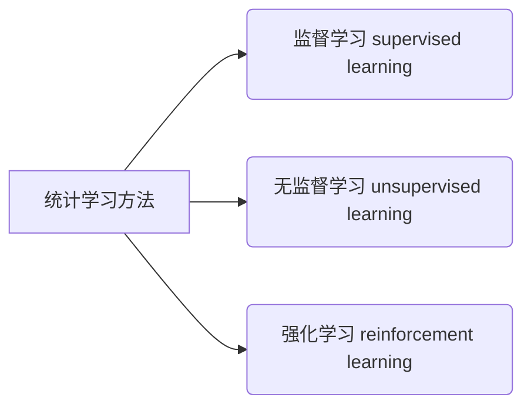
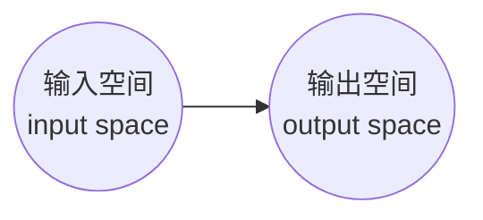
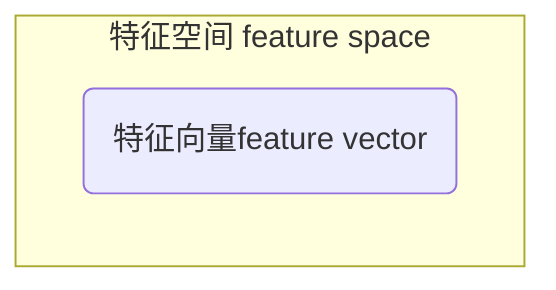
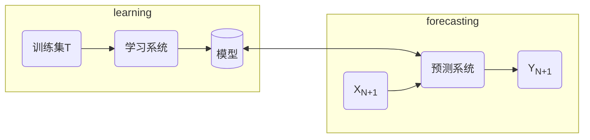
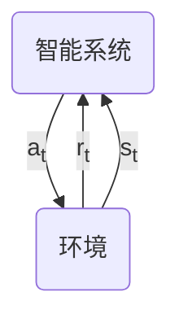
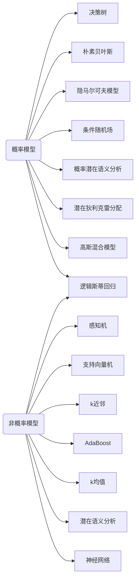
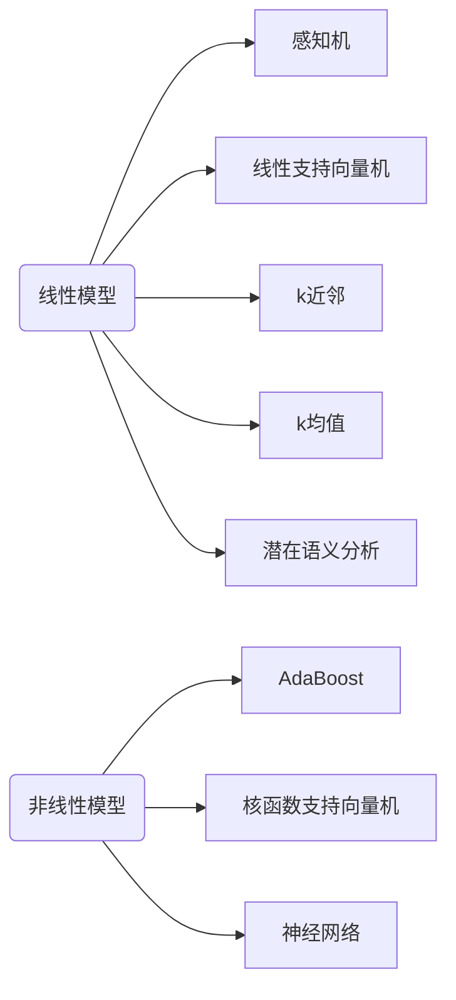

# 统计学习方法

- 统计学习(statistical learning)/统计机器学习(statistical machine learning)：计算机基于数据构建概率统计模型，并运用模型对数据进行预测和分析

- 研究的对象：数据(data)

- 关于数据的基本假设：同类数据(具有某种共同性质的数据)具有一定的统计规律性

- 统计学习用于对数据(包括未知数据)的预测和分析；总的目标是：考虑学习怎样的模型和如何学习模型，以便使模型更准确地预测分析数据，也要考虑提高学习效率

- 统计学习方法三要素：模型(model)、策略(strategy)、算法(algorithm)

- 实现统计学习方法地步骤：

## 监督学习(supervised learning)

定义：从标注数据中学习预测模型；本质上是学习输入到输出的映射的统计规律

输入变量$X$，输出变量$Y$;变量取值时小写，$x,y$；

输入实例$x$的特征向量记作:

$$
x=\left(x^{(1)},x^{(2)},\cdots,x^{(i)},\cdots,x^{(n)} \right)^T
$$

$x^{(i)}$是$x$的第$i$个特征；

$x^{(i)}$不同于$x_i$，$x_i$表示多个输入变量中的第$i$个变量

训练集表示为：

$$
T=\left \{ (x_1,y_1),(x_2,y_2),\cdots,(x_N,y_N) \right \}
$$

输入输出对$(x_i,y_i)$又称为样本(sample)或样本点

联合概率分布$P(X,Y)$表示分布函数，或分布密度函数

假设空间(hypothesis space)：由输入空间到输出空间的映射的集合。

首先给定训练数据集：

$$
T=\left\\{ (x_1,y_1),(x_2,y_2),\cdots,(x_N,y_N) \right\\}
$$

其中，$(x_i,y_i),i=1,2,\cdots,N$称为样本或样本点；$x_i \in \mathcal{X} \subseteq  \mathbb{R}^n$是输入的观测值(也称为输入或实例)，$y_i \in \mathcal{y}$是输出的观测值(也称输出)。

学习过程中，学习系统通过给定的训练集，训练(学习)得到一个模型，表示为条件概率分布$\hat{P}(Y|X)$或决策函数$Y=\hat{f}(x)$。$\hat{P}(Y|X)$和$\hat{f}(X)$描述输入与输出之间的映射关系。

在预测过程中，预测系统对于给定的测试样本集中的输入$x_{N+1}$，由模型$y_{N+1}=\arg \underset{y}{\max} \hat{P}(y|x_{N+1})$或$y_{N+1}=\hat{f}(x_{N+1})$得到相应的输出$y_{N+1}$

对于输入$x_i$，一个具体的模型$y=f(x)$可以产生一个输出$f(x_i)$；在训练集中$x_i$对应的输出是$y_i$，当模型具有很好的预测能力时，模型输出$f(x_i)$和训练样本输出$y_i$的差应该足够小

## 无监督学习(unsupervised learning)

从无标注数据中学习预测模型；本质是学习数据中的统计规律或潜在结构

每个输入时一个实例，由特征向量表示。

输出是对输入的分析结果，由输入的类别、转换或概率表示。

模型实现对数据的聚类、降维或概率估计。

设$\mathcal{X}$是输入空间，$\mathcal{Z}$是隐式结构空间。

学习的模型可以表示为函数$z=g(x)$，条件概率分布$P(z|x)$或$P(x|z)$；$x\in \mathcal{X}$是输入，$z\in\mathcal{Z}$是输出

所有模型的集合称为假设空间

## 强化学习(reinforcement learning)

智能系统在与环境的连续互动中学习最优行为策略；本质是学习最优的序贯决策。

状态(state)$s_t$，奖励(reward)$r_t$，动作(action)$a_t$

强化学习的五元组：$\langle S,A,P,r,\gamma \rangle$

- S 有限状态(state)的集合
- A 有限动作(action)的集合
- P 状态转移概率(transition probability)

$$
P(s^{'}|s,a)=P(s_{t+1}=s^{'}|s_t=s,a_t=0)
$$

- $r$奖励函数(reward function)：$r(s,a)=E(r_{t+1}|s_t=s,a_t=0)$
- $\gamma$衰减系数(discount factor)：$\gamma \in [0,1]$
  
策略$\pi$：给定状态下，动作的函数$a=f(s)$或条件概率分布$P(a|s)$

价值函数(value function)/状态价值函数(state value function)：策略$\pi$从某一个状态$s$开始的，长期累计奖励的数学期望：

$$
v_{\pi}=E_{\pi}[r_{t+1}+\gamma r_{t+2}+{\gamma}^2 r_{t+3}+\cdots|s_t=s]
$$

动作价值函数(action value function)：策略$\pi$从某个状态$s$和动作$a$开始的，长期累积奖励的数学期望:

$$
q_{\pi}(s,a)=E_{\pi}[r_{t+1}+\gamma r_{t+2}+{\gamma}^2 r_{t+3}+\cdots|s_t=s,a_t=a]
$$

强化学习的目标：在所有可能的策略中选出价值函数最大的策略$\pi$。

## 半监督学习(semi-supervised learning)

利用未标注数据的信息，辅助标注数据，进行监督学习，以较低的成本达到较好的学习效果。

## 主动学习(active learning)

找出对学习最有帮助的实例让老师标注，以较小的标注代价，达到较好的学习效果。

概率模型(probabilistic model)、非概率模型(non-probabilistic model)

||概率模型|非概率模型|
|----|----|----|
|监督学习|条件概率分布形式$P(y\|x)$|函数形式$y=f(x)$|
|非监督学习|$P(z\|x)$或$P(x\|z)$|$z=g(x)$|

概率模型与非概率模型的区别在于模型的内在结构。

若函数$y=f(s)$或$z=g(x)$是线性函数，则称模型是线性模型，否则模型称为非线性模型。

## $k$近邻模型

### 构造平$kd$树

